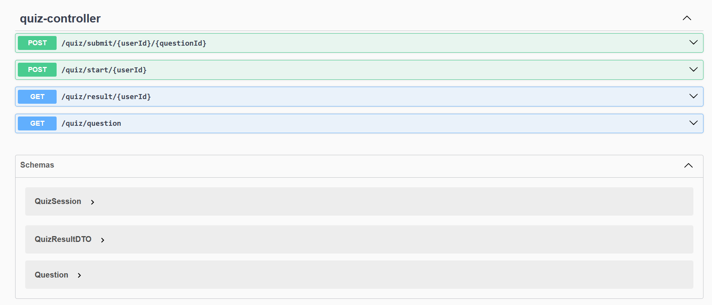
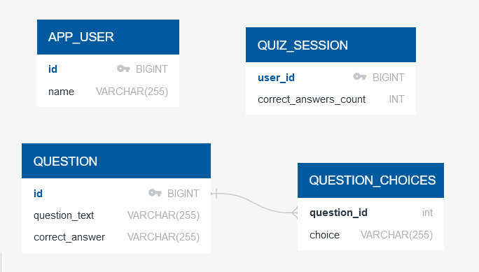

# Quiz App - Internship Assignment

This is a **Quiz App** built with **Spring Boot** as part of an internship assignment. The application allows users to:

1. Start a new quiz session.
2. Get a random multiple-choice question.
3. Submit answers to questions and track correct/incorrect submissions.
4. Retrieve statistics on answered questions.

The application uses **H2 Database** for data storage, and **Spring Data JPA** for managing database interactions.

## Features

- **Start New Quiz Session**: Create a new session for the user to start answering questions.
- **Random Question**: Fetch a random multiple-choice question from the database.
- **Submit Answer**: Submit answers for each question and check if they are correct.
- **Quiz Stats**: Retrieve statistics on the number of questions answered, along with correct and incorrect submissions.

## Technologies Used

- **Backend**: Java, Spring Boot
- **Database**: H2 (In-memory Database)
- **JPA**: For database interaction
- **Swagger**: For API documentation and testing

## How to Run the Project

1. **Clone the Repository**:
   ```bash
   git clone https://github.com/parth-n/ConceptileQuiz

2. **Build the project**: Use Maven
    ```bash
    mvn clean install -DskipTests

3. **Run the application**: Start the SpringBoot application
    ```bash
    mvn spring-boot:run

4. **Access the H2 database from the browser**:
    ```bash
   localhost:8080/h2-console
5. Use the following credentials to connect to the H2 database:
    ```bash
   JDBC Url : jdbc:h2:mem:testdb
   User: sa
   Password: password
6. **API Endpoints and Entity Schema is available at Swagger URL**
    ```bash
    localhost:8080/swagger-ui/index.html

<p>
  
   
 </p>
